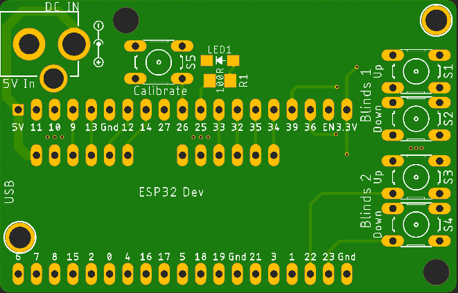
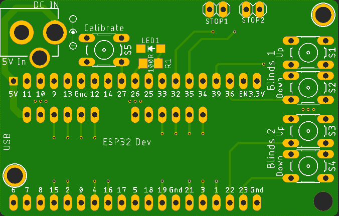

# Boards
 The schematic folder contains the board and schematic files in Eagle format

## Files for ESP32 Blinds Motor w/o Endstop Headers
- _Blinds Motor ESP32.brd_ - Blinds Motor board file
- _Blinds Motor ESP32.sch_ - Blinds Motor schematic file

## Files for ESP32 Blinds Motor with Endstop Headers
- _Blinds Motor ESP32 w endstops.brd_ - Blinds Motor with Endstop board file
- _Blinds Motor ESP32 w endstops.sch_ - Blinds Motor with Endstop schematic file

**You need _both_ the .brd and .sch files to open the board in Eagle.**

## Designs
- One design excludes headers for endstop microswitches
- One design includes a header for a endstop microswitch
ESP32 Blinds Motor

ESP32 Blinds Motor w/ Endstop Header

**Files are provided as is with no guarantees express or implied**